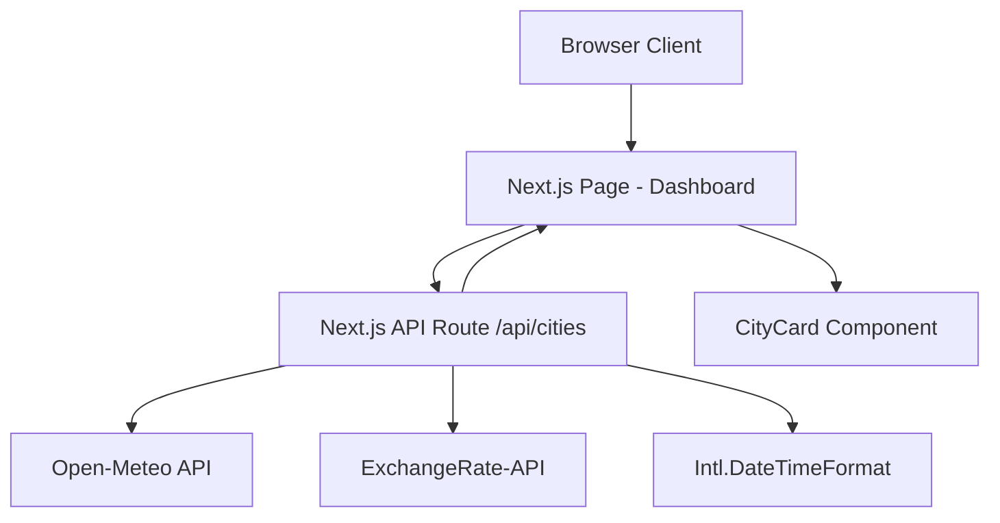

# Architecture

## System Overview

CityPulse is a server-rendered Next.js application that aggregates real-time city data (local time, temperature, currency exchange rate) from free public APIs and presents it in a mobile-first responsive dashboard. Next.js API routes act as a backend proxy layer, fetching and normalizing data from external APIs. The React frontend consumes these internal API routes and auto-refreshes every 60 seconds.

This project has a UI layer. UI testing subagent will be activated in Phase 5 for units that touch UI files.

## Tech Stack

| Layer | Technology | Rationale |
|-------|------------|-----------|
| Frontend | Next.js 14 (App Router) + React 18 | SSR/SSG support, easy Vercel deploy, React ecosystem |
| Styling | Tailwind CSS | Utility-first, mobile-first by default, zero runtime cost |
| Backend | Next.js API Routes (Route Handlers) | Same codebase, no separate server, foundation for future versions |
| Database | None (v1) | No persistent data needed — all data is fetched live from APIs |
| Infrastructure | Vercel (free tier) | Zero-config Next.js deployment, free SSL, edge network |
| Auth | None (v1) | No user accounts in MVP |
| Weather API | Open-Meteo | Free, no API key, 10k requests/day, quality data sources |
| Currency API | ExchangeRate-API (open endpoint) | Free, no API key, 1.5k requests/month, daily rates |
| Time | Built-in Intl.DateTimeFormat | No external API needed, timezone-aware formatting |

## Component Diagram



## Data Models

### Entity: City (hardcoded config)
| Field | Type | Description |
|-------|------|-------------|
| name | string | Display name (e.g. "Plano") |
| country | string | Country name (e.g. "USA") |
| timezone | string | IANA timezone (e.g. "America/Chicago") |
| lat | number | Latitude for weather API |
| lon | number | Longitude for weather API |
| currencyCode | string | ISO 4217 code (e.g. "USD") |
| currencyName | string | Display name (e.g. "US Dollar") |

### Entity: CityData (API response)
| Field | Type | Description |
|-------|------|-------------|
| name | string | City display name |
| country | string | Country name |
| localTime | string | Formatted local time string |
| temperature | number | Current temperature in °C |
| currencyName | string | Local currency display name |
| exchangeRate | number | 1 USD = X local currency |

## API Design

### Internal API Route

#### `GET /api/cities`
Returns aggregated data for all 5 cities. The backend fetches weather and currency data from external APIs, combines with timezone calculations, and returns a normalized response.

**Response**:
```json
{
  "cities": [
    {
      "name": "Plano",
      "country": "USA",
      "localTime": "2:30 PM",
      "temperature": 28,
      "currencyName": "US Dollar",
      "exchangeRate": 1.00
    }
  ],
  "lastUpdated": "2026-03-15T14:30:00Z"
}
```

### External APIs Consumed

| API | Endpoint | Purpose |
|-----|----------|---------|
| Open-Meteo | `GET /v1/forecast?latitude={lat}&longitude={lon}&current_weather=true` | Current temperature |
| ExchangeRate-API | `GET /v6/latest/USD` | USD exchange rates |

## Architecture Decision Records

### ADR-001: Next.js with Server-Side API Routes
- **Decision**: Use Next.js App Router with Route Handlers as the backend layer
- **Context**: The app needs to fetch data from multiple external APIs. A backend proxy avoids CORS issues, enables response caching, and provides a foundation for future versions
- **Options Considered**: (1) Client-side direct API calls, (2) Next.js API routes, (3) Separate Express backend
- **Rationale**: Next.js API routes keep everything in one codebase with zero deployment overhead on Vercel. Client-side calls would expose API patterns and hit CORS issues. A separate backend is unnecessary complexity for v1
- **Consequences**: All external API calls go through the Next.js server. Slightly higher latency per request vs direct client calls, but enables caching and rate-limit protection

### ADR-002: Open-Meteo for Weather Data
- **Decision**: Use Open-Meteo as the weather data provider
- **Context**: Need current temperature for 5 cities using only free APIs
- **Options Considered**: (1) Open-Meteo, (2) OpenWeatherMap free tier, (3) WeatherAPI.com free tier
- **Rationale**: Open-Meteo requires no API key (simplest setup), offers 10,000 requests/day (most generous), and sources data from national weather services. OpenWeatherMap requires a key and attribution. WeatherAPI.com requires a key
- **Consequences**: No API key management needed. Non-commercial license is acceptable for this project. WMO weather codes used instead of descriptive icons (acceptable since v1 only shows temperature)

### ADR-003: ExchangeRate-API for Currency Data
- **Decision**: Use ExchangeRate-API open endpoint for exchange rates
- **Context**: Need USD exchange rates for 4 currencies (INR, GBP, JPY, SGD)
- **Options Considered**: (1) ExchangeRate-API, (2) Open Exchange Rates, (3) FreeCurrencyAPI
- **Rationale**: No API key required on the open endpoint, HTTPS supported, daily rate updates are sufficient for currency data. Open Exchange Rates free tier is HTTP-only (mixed content issues). FreeCurrencyAPI requires a key
- **Consequences**: 1,500 requests/month limit — requires server-side caching (cache exchange rates for 1+ hours). Daily rate updates mean currency data may be slightly stale, which is acceptable

### ADR-004: Intl.DateTimeFormat for Local Time
- **Decision**: Use JavaScript's built-in Intl.DateTimeFormat with IANA timezone identifiers
- **Context**: Need to display current local time for each city
- **Options Considered**: (1) Intl.DateTimeFormat, (2) WorldTimeAPI, (3) moment-timezone/luxon
- **Rationale**: Built-in browser/Node.js API — zero dependencies, no external API calls, no rate limits. IANA timezone database is maintained and accurate
- **Consequences**: Time formatting happens client-side for live updates. No additional API calls or dependencies needed

### ADR-005: Tailwind CSS for Styling
- **Decision**: Use Tailwind CSS for all styling
- **Context**: Need a mobile-first responsive dashboard UI
- **Options Considered**: (1) Tailwind CSS, (2) Plain CSS/CSS Modules, (3) styled-components
- **Rationale**: Utility-first approach enables rapid mobile-first development. Built-in responsive breakpoints. Zero runtime CSS-in-JS overhead. First-class Next.js support
- **Consequences**: Requires Tailwind configuration. Utility classes in JSX can be verbose but are highly readable for responsive layouts
